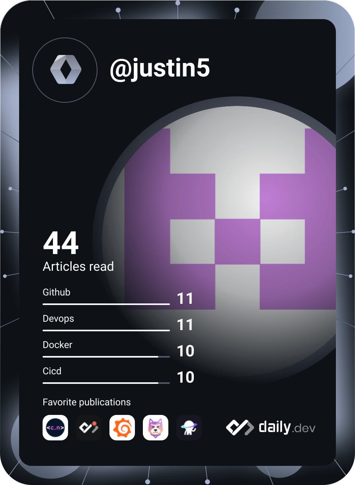

  

  <!-- GitHub Streak -->
  
   
  <!-- GitHub Readme Stats -->
  
  
  
   
  
  <!-- GitHub Trends (avgupta456) -->
  

  
 
🚀 <b>SRE Engineer</b> focused on building robust <b>Kubernetes</b> infrastructure and automating <b>DevOps</b> pipelines.

  

  

### 🛠️ Tech Stack

 

### 🔭 I’m currently working on
- Automating cluster provisioning with Terraform and Ansible.
- Enhancing observability stacks using Prometheus and Grafana.

### 🌱 I’m currently learning
- Advanced Service Mesh patterns (Istio/Linkerd).
- eBPF for networking and security.

   
  

